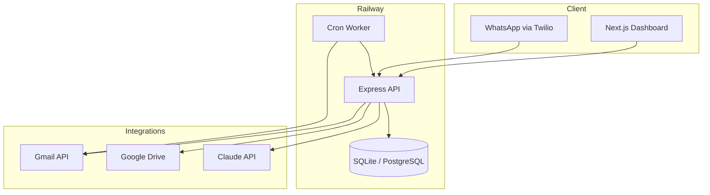

# AI Office Worker — SaaS Roadmap

**Product:** Production-ready SaaS for Israeli businesses  
**Stack:** Node.js · Prisma · SQLite → PostgreSQL · Next.js · Claude · Twilio · Google APIs  
**Deploy:** Railway (API + worker) · Netlify (frontend)

---

## Architecture



---

## MVP (Built — Phase 1)

| Feature | Status | Implementation |
|---------|--------|----------------|
| Gmail auto scan | ✅ | `gmail-sync.ts` + cron 07:00 |
| Task extraction | ✅ | Claude → `Task` model |
| Invoice / payment detection | ✅ | Claude JSON + heuristics |
| Google Drive save | ✅ | Upload attachments |
| Supplier payments table | ✅ | Prisma `SupplierPayment` |
| Duplicate prevention | ✅ | `duplicateHash` unique |
| Missing invoice report | ✅ | `/api/reports/missing-invoices` |
| Upcoming payment alerts | ✅ | `checkUpcomingPaymentAlerts` |
| Daily owner summary | ✅ | API + WhatsApp |
| Dashboard KPIs | ✅ | money to pay, pending, missing |
| WhatsApp 08:00 summary | ✅ | worker cron |
| WhatsApp 18:00 summary | ✅ | worker cron |
| WhatsApp new invoice alert | ✅ | on create |
| WhatsApp commands | ✅ | HELP, STATUS, SYNC, etc. |

### Database schema

See `backend/prisma/schema.prisma`:

- `User`, `Organization` — tenant
- `Integration` — OAuth tokens (gmail)
- `SupplierPayment` — core table
- `Task`, `EmailMessage`, `Alert`, `SyncLog`, `WhatsAppLog`

### Folder structure

```
ai-office-worker/
├── backend/          # Node.js API + Prisma + worker
├── frontend/         # Next.js dashboard (RTL Hebrew)
├── docs/             # Beginner setup
├── legacy/           # Old Make.com Phase 0 (optional)
├── ROADMAP-SAAS.md
└── package.json      # npm workspaces
```

---

## Phase 2 (Next 4–6 weeks)

| Feature | Notes |
|---------|--------|
| Camera invoice scan | Mobile web upload → Claude vision |
| Business health score | Rules + trends from payments |
| Payment duplicate detection | Fuzzy match beyond hash |
| Collection reminders | WhatsApp + email to suppliers |
| Money to receive | Receivables model |
| Google Sheets sync | Optional export |
| PostgreSQL on Railway | Replace SQLite |
| Multi-tenant billing | Stripe Customer portal |

---

## Phase 3 (Future)

| Feature | Notes |
|---------|--------|
| CRM | Contacts, deals |
| Lead engine | Landing + scoring |
| Social automation | Meta API |
| Google Reviews | Auto-reply drafts |
| Stripe payments | Subscriptions |

---

## Deployment checklist

- [ ] Railway API service + env vars
- [ ] Railway worker service
- [ ] Netlify frontend `NEXT_PUBLIC_API_URL`
- [ ] Google OAuth production redirect URIs
- [ ] Twilio webhook URL
- [ ] Migrate to PostgreSQL (`provider = "postgresql"`)
- [ ] HTTPS only, rotate `JWT_SECRET`

---

## API reference (MVP)

| Method | Path | Auth |
|--------|------|------|
| GET | `/auth/google` | — |
| GET | `/auth/google/callback` | — |
| GET | `/api/dashboard` | JWT |
| GET | `/api/payments` | JWT |
| PATCH | `/api/payments/:id` | JWT |
| GET | `/api/tasks` | JWT |
| POST | `/api/sync/gmail` | JWT |
| GET | `/api/reports/missing-invoices` | JWT |
| POST | `/cron/gmail-sync-all` | `x-cron-secret` |
| POST | `/webhooks/twilio/whatsapp` | Twilio |

---

## Legacy Make.com path

The original no-code MVP lives in `docs/`, `templates/`, `make/`.  
**New development uses the SaaS codebase only.**
