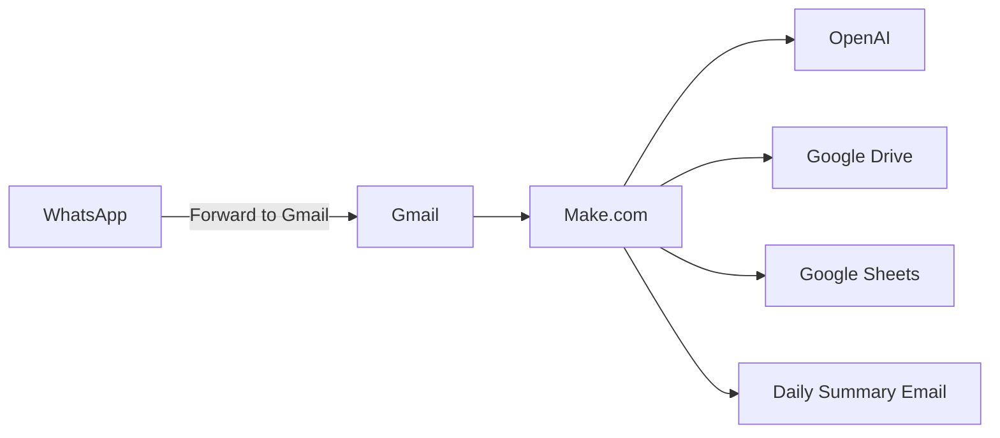

# AI Office Worker — Development Roadmap

**Audience:** Complete beginners  
**Region:** Israel · Hebrew · ILS (₪)  
**Gmail:** Personal Gmail (migrate to Google Workspace later)  
**WhatsApp MVP:** Forward invoices/documents to Gmail  

**Orchestration:** [Make.com](https://www.make.com)  
**APIs:** Gmail · Google Drive · Google Sheets · OpenAI  

---

## What this product does

AI Office Worker acts as a digital clerk that:

1. Scans Gmail every day (including WhatsApp-forwards).
2. Extracts tasks from emails (Hebrew).
3. Detects invoices and payment requests (חשבונית / דרישת תשלום).
4. Saves files into organized Google Drive folders.
5. Maintains a **Supplier Payments** Google Sheet with payment tracking.
6. Produces a **Missing Invoices** report.
7. Sends a **daily summary** email in Hebrew.

---

## Architecture



---

## Phase overview

| Phase | Name | Status | Deliverable |
|-------|------|--------|-------------|
| **0** | Foundation | ✅ Repo + templates | Folders, Sheet, connections |
| **1** | Daily Gmail scan | Pending | Scenario `01` |
| **2** | AI classification | Pending | Scenario `02` + Hebrew prompts |
| **3** | Drive organizer | Pending | Scenario `03` |
| **4** | Sheets writer | Pending | Scenario `04` |
| **5** | Missing invoices | Pending | Scenario `05` |
| **6** | WhatsApp via Gmail | Pending | Filter + label `WhatsApp-Forwarded` |
| **7** | Daily summary | Pending | Scenario `07` |
| **8** | Testing & go-live | Pending | Test checklist |

---

## Phase 0 — Foundation (YOU ARE HERE)

### Completed in this repository

- [x] Project folder structure
- [x] `ROADMAP.md` (this file)
- [x] CSV templates for all sheets
- [x] Local `drive-structure/` mirror
- [x] Google Apps Script to create Drive folders
- [x] Beginner guide: `docs/phase-0-google-setup.md`
- [x] WhatsApp → Gmail guide: `docs/gmail-whatsapp-forwarding.md`
- [x] Hebrew OpenAI prompt: `prompts/classify-email-he.md`

### Your manual steps (30–60 minutes)

1. **Google Cloud** — create project, enable Gmail + Drive + Sheets APIs, OAuth consent screen.
2. **Make.com** — connect Gmail, Drive, Sheets, OpenAI.
3. **Run Apps Script** — create Drive folder tree (see `google-apps-script/`).
4. **Import CSVs** — create spreadsheet **Supplier Payments** from `templates/sheets/`.
5. **Gmail** — create labels and WhatsApp forward address (see `docs/`).
6. **Config sheet** — fill `config.csv` values in the `Config` tab.

Details: [docs/phase-0-google-setup.md](./docs/phase-0-google-setup.md)

---

## Phase 1 — Daily Gmail scan

**Scenario:** `01 - Daily Gmail Scan`  
**Trigger:** Every day 07:00 (Asia/Jerusalem)

**Gmail search query (Israel / Hebrew):**

```
newer_than:1d (
  has:attachment OR
  subject:(חשבונית OR חשבונית מס OR דרישת OR תשלום OR invoice OR payment) OR
  (חשבונית OR תשלום OR invoice)
)
```

**Filters:**

- Skip: `noreply@`, newsletters, `no-reply`
- Optional label: `AI-Office-Worker/Processed` after success

**Output:** List of emails → Phase 2

---

## Phase 2 — OpenAI extraction (Hebrew)

**Scenario:** `02 - AI Classify Email`  
**Prompt file:** [prompts/classify-email-he.md](./prompts/classify-email-he.md)

**JSON fields:** `supplier_name`, `document_type`, `amount`, `currency` (ILS), `payment_required`, `tasks[]`, `confidence`

**Low confidence (< 0.7):** Gmail label `AI-Office-Worker/Manual-Review`

---

## Phase 3 — Google Drive organizer

**Scenario:** `03 - Organize Attachments`

| document_type | Drive path |
|---------------|------------|
| invoice | `AI-Office-Worker/Invoices/{Supplier}/` |
| payment_request | `AI-Office-Worker/Payment-Requests/{Supplier}/` |
| receipt | `AI-Office-Worker/Receipts/{Supplier}/` |
| other | `AI-Office-Worker/Other/{Supplier}/` |

**File name:** `YYYY-MM-DD_{Supplier}_{Type}_{original}.pdf`

---

## Phase 4 — Supplier Payments sheet

**Scenario:** `04 - Upsert Supplier Payment Row`  
**Template:** [templates/sheets/supplier-payments.csv](./templates/sheets/supplier-payments.csv)

**Duplicate key:** Date + Supplier Name + Subject (same payment event)

**Column I formula (Missing invoice):**

```excel
=IF(AND(E2="Yes"; G2<>""; H2=""); "Yes"; "No")
```

Use `,` instead of `;` if your Sheets locale is English.

---

## Phase 5 — Missing Invoices report

**Scenario:** `05 - Missing Invoices Report`  
**Trigger:** Weekly Sunday 08:00

**Rule:** Payment Required = Yes, payment request link exists, invoice receipt link empty.

**Output:** `AI-Office-Worker/Reports/Missing-Invoices/YYYY-MM-DD-missing-invoices.pdf` (or Sheet tab) + email.

---

## Phase 6 — WhatsApp via Gmail (MVP)

**No separate API in MVP.**

1. User forwards WhatsApp PDF/image to dedicated Gmail alias or main inbox.
2. Gmail filter: `from:your-phone OR subject:(WhatsApp OR וואטסאפ)` → label `WhatsApp-Forwarded`
3. Make scenario treats labeled mail same as Phase 1–4.

Guide: [docs/gmail-whatsapp-forwarding.md](./docs/gmail-whatsapp-forwarding.md)

---

## Phase 7 — Daily summary (Hebrew)

**Scenario:** `07 - Daily Summary Email`  
**Trigger:** Daily 18:00 Asia/Jerusalem

**Email sections:**

- סיכום יומי — AI Office Worker
- מיילים שעובדו
- חשבוניות חדשות
- דרישות תשלום
- משימות חדשות
- חשבוניות חסרות (קישור לדוח)

---

## Phase 8 — Testing checklist

| # | Test | Expected |
|---|------|----------|
| 1 | Forward test PDF from WhatsApp to Gmail | Processed, Drive + Sheet |
| 2 | Email with payment request only | Missing invoice = Yes |
| 3 | Follow-up invoice same supplier | Row updated, link in column H |
| 4 | Newsletter | Skipped |
| 5 | Hebrew subject חשבונית מס | Classified as invoice |
| 6 | Daily summary | Hebrew email at 18:00 |

---

## Make.com scenario checklist

Copy into Make.com as scenario names:

1. `01 - Daily Gmail Scan`
2. `02 - AI Classify Email`
3. `03 - Organize Attachments`
4. `04 - Upsert Supplier Payment Row`
5. `05 - Missing Invoices Report`
6. `06 - WhatsApp Forward Handler` (filter only; can merge with 01)
7. `07 - Daily Summary Email`
8. `99 - Error Alert to Admin`

See [make/scenarios-checklist.md](./make/scenarios-checklist.md).

---

## Migration: Personal Gmail → Workspace

When you move to Google Workspace:

1. Re-authorize Make.com connections with the Workspace account.
2. Update `Config` sheet: `gmail_account`, `summary_recipient`.
3. Replace personal `@gmail.com` filters with domain aliases (e.g. `finance@yourdomain.co.il`).
4. Review OAuth consent screen (Internal vs External).
5. Keep the same Drive folder names to avoid breaking Make paths.

---

## Cost estimate (Israel small business)

| Service | Monthly (approx.) |
|---------|-------------------|
| Make.com Core | ~$9–29 |
| OpenAI API | ₪20–200 (volume) |
| Google | ₪0 with personal/Workspace |
| WhatsApp forward | ₪0 |

---

## Next step after Phase 0

→ Start **Phase 1** in Make.com using [make/scenarios-checklist.md](./make/scenarios-checklist.md).

Ask your lead engineer to implement Phase 1 module-by-module when Phase 0 checklist is 100% green.
